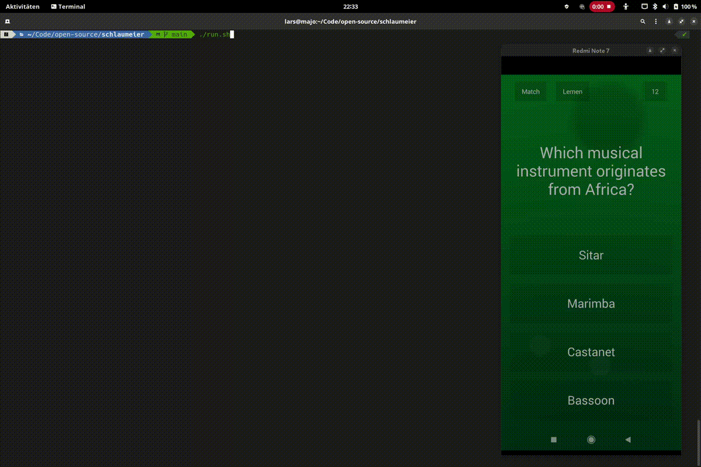

# 🧙‍♂️ schlaumeier

[](https://github.com/larswaechter/schlaumeier/actions/workflows/tests.yaml)

_schlaumeier_ is a bot written in Python that allows you to automatically solve Android quiz games like [QuizDuel](https://play.google.com/store/apps/details?id=se.maginteractive.quizduel2&hl=en&gl=US), [Quiz Planet](https://play.google.com/store/apps/details?id=com.lotum.quizplanet&hl=en&gl=US) or [General Knowledge Quiz](https://play.google.com/store/apps/details?id=com.timleg.quiz&hl=en&gl=US) using [ADB](https://developer.android.com/studio/command-line/adb), [OpenCV](https://opencv.org/) and OpenAI's [ChatGPT API](https://openai.com/blog/gpt-3-apps). In my case, I have tested it for solving questions from the games _Quiz Planet_ and _General Knowledge Quiz_ but other ones should work as well with some adjustments. The script works by creating a screenshot, extracting the question and passing it to ChatGPT. See below for more details on how it works.

Note that since ChatGPT isn't perfect and has limited knowledge, the answers given are not always correct too. Moreover, the API response times and its request limit might play a role depending on the game. For predicting the answer to a question, OpenAI's [`gpt-3.5-turbo`](https://platform.openai.com/docs/models/gpt-3-5) model is used.

This software was written for research purposes only and should not be used to gain an unfair advantage in any game. Most games **prohibit** the use of such tools. Always remember: **play fair** and respect the game♎.

## 💡 How it works



_schlaumeier_ makes use of two technologies: [optical character recognition
](https://en.wikipedia.org/wiki/Optical_character_recognition) (OCR) and [large language models](https://blogs.nvidia.com/blog/2023/01/26/what-are-large-language-models-used-for/#:~:text=A%20large%20language%20model%2C%20or,successful%20applications%20of%20transformer%20models.) (LLMs). The core idea behind it, is actually quite simple:

1. Take a screenshot of the app using ADB
2. Slice the screenshot in 5 areas
   - Question
   - Answer A-D
3. Extract the text in each area using OpenCV
4. Send the question to the ChatGPT API
   - Including the possible answers
5. Extract the model's answer
6. "Touch" the answer on your phone using ADB
7. Repeat the procedure for each question

A question prompted to ChatGPT might looks like this for example:

```
In which European capital can you find the fine arts museums known as the "Petit Palais” and the "Grand Palais"? A: London? B: Paris? C: Madrid? D: Berlin? A, B, C or D?
```

As you can see, the possible solutions are provided at the end of the question. ChatGPT's answer:

```
B: Paris
```

The given answer `B` is then processed in the following steps.

At the moment, the agent does not work completely autonomously. There's still some interaction of the user required. However, this depends on the game and can be changed according to personal preferences. Especially ads might interrupt the game flow. The Android Debug Bridge (ADB) is being used to trigger touch events and more on your phone.

Feel free to create a [fork](https://github.com/larswaechter/schlaumeier/fork) and develop a version for your prefered game!

## 📝 Requirements

The following software/hardware is required:

- Android Smartphone (or emulator)
  - Root is **not** required
  - [USB-Debugging](https://developer.android.com/studio/debug/dev-options#Enable-debugging) enabled
- [ChatGPT API Key](https://devopsforu.com/how-to-connect-to-chat-gpt-api/)
- Docker Setup
  - [Docker](https://www.docker.com/)
- Native Setup
  - [Python](https://www.python.org/)
  - [Tesseract](https://github.com/tesseract-ocr/tesseract)
  - [ADB-Tools](https://developer.android.com/studio/command-line/adb)

Especially the Tesseract version, that is used to recognize texts on images, plays a major role. I've tested the following one, which works quite well for the English language:

```
tesseract 5.3.0
 leptonica-1.82.0
  libgif 5.2.1 : libjpeg 8d (libjpeg-turbo 2.1.4) : libpng 1.6.39 : libtiff 4.5.0 : zlib 1.2.13 : libwebp 1.3.0 : libopenjp2 2.5.0
 Found AVX2
 Found AVX
 Found FMA
 Found SSE4.1
 Found OpenMP 201511
 Found libarchive 3.6.2 zlib/1.2.13 liblzma/5.2.9 bz2lib/1.0.8 liblz4/1.9.4 libzstd/1.5.2
 Found libcurl/7.87.0 OpenSSL/3.0.8 zlib/1.2.13 brotli/1.0.9 zstd/1.5.2 libidn2/2.3.4 libpsl/0.21.2 (+libidn2/2.3.4) libssh2/1.10.0 nghttp2/1.52.0
```

Unfortunately, the changes between the individual Tesseract versions do not make a consistent testing easy. There exist some [tests](https://github.com/larswaechter/schlaumeier/blob/main/tests.py), but most of them are currently commented out, because the texts are not recognized as expected on some systems, like in the GitHub Actions pipeline for example.

## 🖥️ Setup

First of all, create a new environment file:

```bash
cp .env.example .env
```

Enter your ChatGPT API KEY:

```
GPT_KEY=YOUR_KEY
```

Enter the language for Tesseract. This should match the language of your Android Game. Make sure that you have the according [language pack](https://tesseract-ocr.github.io/tessdoc/Data-Files-in-different-versions.html) installed on your system.

```
TESSERACT_LANG=YOUR_LANG
```

Next, enter the screen slices for the question and answers A-D. They depend on your phone's display. The slices are later used to crop the screenshot in smaller images and to extract the text in each of them.

The values (pixels) are encoded as `heightFrom:heightTo-widthFrom:widthTo`.

```
SLICE_Q=700:1400-0:1080
SLICE_ANSW_A=1465:1775-65:515
SLICE_ANSW_B=1465:1775-565:1015
SLICE_ANSW_C=1825:2135-65:515
SLICE_ANSW_D=1825:2135-565:1015
```

**TIP**: You can find them easily by enabling [Pointer Location](https://developer.android.com/studio/debug/dev-options#input) in your phone's developer options.

Assuming the following scenario:


In this example, the pixel slice for answer A ranges vertically from `y_1=1465` to `y_2=1775` and horizontally from `x_1=65` to `x_2=515`. So the image for answer A, cropped based on these coordinates, looks like this:


The green rectangle marks the text on the image recognized by Terrasect. Make sure that there's no border left when cropping the image. Otherwise, you might get some problems when recognizing the text snippets. See more examples [here](https://github.com/larswaechter/quizmaster/tree/main/examples).

For the next steps, make sure your phone is **connected via USB**. You have to allow the USB debugging connection on your phone when running the script for the first time. You can run _schlaumeier_ either with Docker or natively.

### Docker

Build the Docker image:

```bash
docker build . -t schlaumeier
```

and run a new container:

```bash
docker run \
   --privileged \
   --env-file .env \
   --rm \
   -p 5037:5037 \
   -it \
   schlaumeier
```

Make sure that there's no ADB server instance running on your host machine.

### Native

For the native setup, the tools listed above are required and you have to install the pip packages:

```bash
pip install -r ./requirements.txt
```

Last but not least run the script:

```bash
./run.sh
```

Alternatively, you can also run `main.py` directly.

The script starts the ADB server and waits for a device to be connected. As decribed above, _schlaumeier_ takes a screenshot, extracts each text part and forwards the question to ChatGPT. During execution, you'll see some helpful console output. Moreover, the screenshots are saved to the [`screenshots`](https://github.com/larswaechter/schlaumeier/tree/main/screenshots) directory. They are deleted before each run.

The answer is automatically entered by the script using a touch event. Afterwards, you can press any key to continue and the procedure is repeated. Press `Ctrl+c` to stop the script at any time.

## 🔑 License

_schlaumeier_ is released under [MIT](https://github.com/larswaechter/schlaumeier/blob/main/LICENSE) license.
