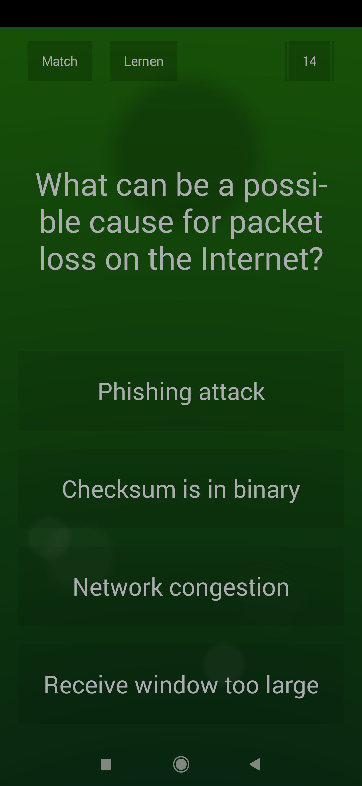

# quizmaster

quizmaster is an example Python script that demonstrates how quiz apps can be automatically solved using [ADB](https://developer.android.com/studio/command-line/adb), [OpenCV](https://opencv.org/) and OpenAI's [ChatGPT API](https://openai.com/blog/gpt-3-apps). In this example, I'm using it for solving the game [Quiz Planet](https://play.google.com/store/apps/details?id=com.lotum.quizplanet&hl=en&gl=US) but other ones should work too.

Note that since ChatGPT isn't perfect, the answers are not always correct.

## How it works

The script is actually quite simple:

1. Take a screenshot of the app using ADB
2. Slice the screenshot in 5 areas
   - Question
   - Answer A-D
3. Extract the text in each area using OpenCV
4. Ask ChatGPT the question using its API
5. Extract the answer
6. "Touch" the answer on your phone using ADB

A question prompted to ChatGPT looks like this:

```
In which European capital can you find the fine arts museums known as the "Petit Palais” and the "Grand Palais"? A: London? B: Paris? C: Madrid? D: Berlin? A, B, C or D?
```

ChatGPT's answer:

```
B: Paris
```

## Requirements

- Android Smartphone
  - [USB-Debugging](https://developer.android.com/studio/debug/dev-options#Enable-debugging) enabled
- [Python](https://www.python.org/)
- [ChatGPT API Key](https://devopsforu.com/how-to-connect-to-chat-gpt-api/)
- [Tesseract](https://github.com/tesseract-ocr/tesseract)

## Setup

First of all, create a new environment file:

```bash
cp .env.example .env
```

Enter your ChatGPT API KEY:

```
GPT_KEY="YOUR_KEY"
```

Next, enter the display coordinates of answer A and D.

```
COORD_ANSW_A="300-1600"
COORD_ANSW_D="800-1900"
```

TIP: You can find them easily by enabling [Pointer Location](https://developer.android.com/studio/debug/dev-options#input) in your phone's developer options.



`COORD_ANSW_A` and `COORD_ANSW_D` are the coordinates of answer A and D. Here, "London" and "Berlin". The coordinates have to be within the touch area of the answer. They are later used to trigger the touch event when selecting the answer.

The coordinates for answer B and C are automatically calculated based on A and D.

Now, enter the screen slices for the question and answer A / D. They are later used to crop the screenshot in 5 areas and to extract each text part. The values are ancoded as: `"hFrom:hTo-wFrom:wTo"`.

```
SLICE_Q="700:1400"
SLICE_ANSW_A="1465:1775-65:515"
SLICE_ANSW_D="1825:2135-565:1015"
```

In this example, the cropped image for answer A looks like this:


Make sure to remove alls the black border when cropping the image. Otherwise, there might be some problems recognizing the text parts. Again, the slices for answer B and C are automatically calculated based on A and D.

See more examples [here](https://github.com/larswaechter/qp-solver/tree/main/examples).

Next, install the Python requirements:

```bash
pip install -r ./requirements.txt
```

The final steps:

1. Connect your phone using USB
2. Start a new Quiz Planet match
3. Wait for the question window
4. Run the script:

```bash
python ./main.py
```

The script takes a screenshot and extracts each text part. During execution you'll see some helpful console output.

The answer will be given automatically by the script. Afterwards, you can press any key to continue. In this case, a touch is simulated to go to the next question and the procedure is repeated. Press `Ctrl+c` to stop the script at any time.
