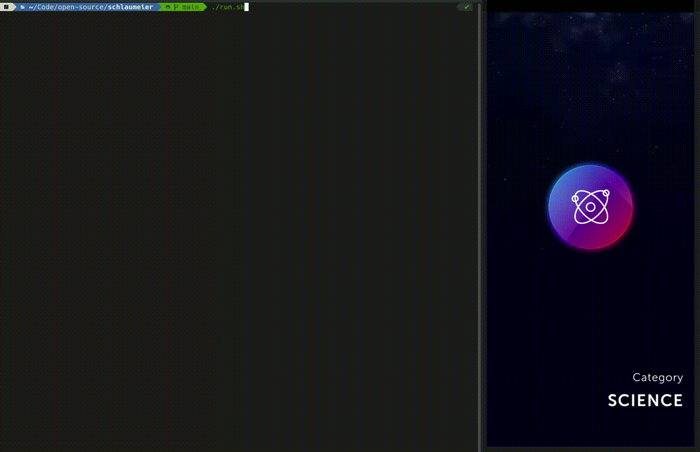

# 🧙‍♂️ schlaumeier

_schlaumeier_ is a Python script that allows you to automatically solve Android quiz games like [Quiz Planet](https://play.google.com/store/apps/details?id=com.lotum.quizplanet&hl=en&gl=US) or [QuizDuel!](https://play.google.com/store/apps/details?id=se.maginteractive.quizduel2&hl=en&gl=US) using [ADB](https://developer.android.com/studio/command-line/adb), [OpenCV](https://opencv.org/) and OpenAI's [ChatGPT API](https://openai.com/blog/gpt-3-apps). In my case, I have tested it for solving questions from the game Quiz Planet but other ones should work as well with some adjustments.

Note that since ChatGPT isn't perfect, the answers given are not always correct too. Moreover, the API response times might play a role depending on the game. For predicting the answer to a question, OpenAI's [`gpt-3.5-turbo`](https://platform.openai.com/docs/models/gpt-3-5) model is used.

This software was written for research purposes only and should not be used to gain an unfair advantage in the game. Most games **prohibit** the use of such tools. Always remember: **play fair** and respect the game♎.

## 💡 How it works



_schlaumeier_ makes use of two technologies: [optical character recognition
](https://en.wikipedia.org/wiki/Optical_character_recognition) (OCR) and [large language models](https://blogs.nvidia.com/blog/2023/01/26/what-are-large-language-models-used-for/#:~:text=A%20large%20language%20model%2C%20or,successful%20applications%20of%20transformer%20models.) (LLM). The core idea behind it, is actually quite simple:

1. Take a screenshot of the app using ADB
2. Slice the screenshot in 5 areas
   - Question
   - Answer A-D
3. Extract the text in each area using OpenCV
4. Send the question to the ChatGPT API
   - Including the possible answers
5. Extract the model's answer
6. "Touch" the answer on your phone using ADB

A question prompted to ChatGPT might looks like this for example:

```
In which European capital can you find the fine arts museums known as the "Petit Palais” and the "Grand Palais"? A: London? B: Paris? C: Madrid? D: Berlin? A, B, C or D?
```

As you can see, the possible solutions are provided in the question. ChatGPT's answer:

```
B: Paris
```

The given answer `B` is then processed in the following steps.

At the moment, the agent does not work completely autonomously. There's still some interaction of the user required. However, this depends on the game and can be changed according to personal preferences.

## 📝 Requirements

- Android Smartphone
  - Root is **not** required
  - [USB-Debugging](https://developer.android.com/studio/debug/dev-options#Enable-debugging) enabled
- [ChatGPT API Key](https://devopsforu.com/how-to-connect-to-chat-gpt-api/)
- Docker Setup
  - [Docker](https://www.docker.com/)
- Native Setup
  - [Python](https://www.python.org/)
  - [Tesseract](https://github.com/tesseract-ocr/tesseract)
  - [ADB-Tools](https://developer.android.com/studio/command-line/adb)

## 🖥️ Setup

First of all, create a new environment file:

```bash
cp .env.example .env
```

Enter your ChatGPT API KEY:

```
GPT_KEY=YOUR_KEY
```

Next, enter the screen `x` and `y` coordinates of the answers A and D. The values are encoded as `x-y`.

```
COORD_ANSW_A=300-1600
COORD_ANSW_D=800-1900
```

**TIP**: You can find them easily by enabling [Pointer Location](https://developer.android.com/studio/debug/dev-options#input) in your phone's developer options.


`COORD_ANSW_A` and `COORD_ANSW_D` are the coordinates of answer A and D. Here, "London" and "Berlin". The coordinates have to be anywhere within the touch area (white rectangle) of the answer. They are later used to trigger the touch event when selecting an answer.

The coordinates for answer B and C are automatically calculated based on A and D. So you don't have to provide them.

Now, enter the screen slices for the question and answer A / D. They are later used to crop the screenshot in 5 smaller images and to extract the text in them. The values are encoded as `hFrom:hTo-wFrom:wTo`.

```
SLICE_Q=700:1400
SLICE_ANSW_A=1465:1775-65:515
SLICE_ANSW_D=1825:2135-565:1015
```

In this example, the cropped image for answer A looks like this:


The green rectangle marks the text in the image. Make sure that there's no border left when cropping the image. Otherwise, there might be some problems recognizing the text snippets. Again, the slices for answer B and C are automatically calculated based on A and D. See more examples [here](https://github.com/larswaechter/quizmaster/tree/main/examples).

For the next steps, make sure your phone is **connected via USB**. You might have to allow USB debugging when running the script. You can run _schlaumeier_ either with Docker or natively.

### Docker

Build the docker image:

```bash
docker build . -t schlaumeier
```

and run it:

```bash
docker run \
   --privileged \
   --env-file .env \
   --rm \
   -p 5037:5037 \
   -it \
   schlaumeier
```

Make sure that there's no ADB server instance running on your host machine.

### Native

For the native setup, the tools listed above are required and you have to install the pip packages:

```bash
pip install -r ./requirements.txt
```

Last but not least run the script:

```bash
./run.sh
```

The script takes a screenshot, extracts each text part and forwards the question to ChatGPT. During execution, you'll see some helpful console output. Moreover, the screenshots taken are saved to the [`screenshots`](https://github.com/larswaechter/schlaumeier/tree/main/screenshots) directory. They are deleted before each run.

The answer will be given automatically by the script. Afterwards, you can press any key to continue. In this case, a touch is simulated to go to the next question and the procedure is repeated. Press `Ctrl+c` to stop the script at any time.

## 🔑 License

_schlaumeier_ is released under [MIT](https://github.com/larswaechter/schlaumeier/blob/main/LICENSE) license.
